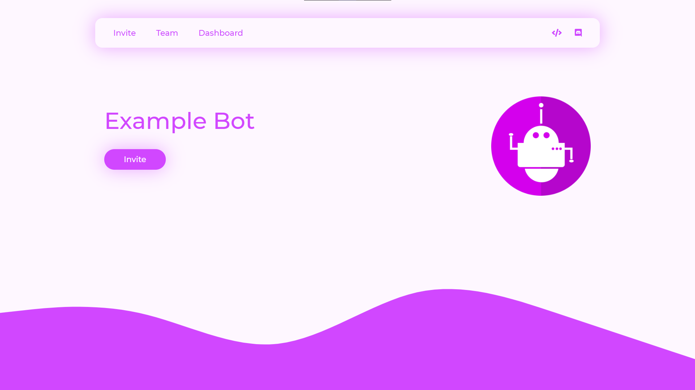
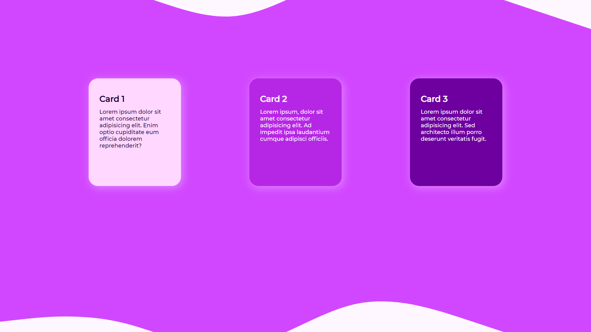
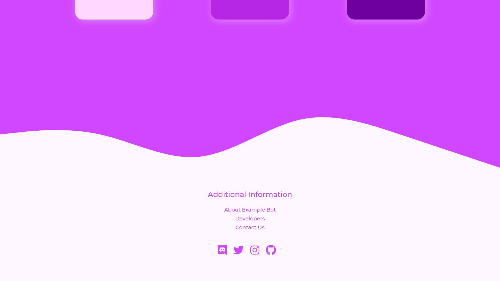

<div align="center">

  <h1>Discord Bot Website Template</h1>

<br>


<br><br>

  <h2>Screenshots</h2>

<br><br>





<br><br>

This is a simple discord bot website template.

<br>

<h2>Installing</h2>

<br>

Download or fork the repo

<br>

```
git clone https://github.com/Zielin0/bot-website-template
```

</div>

<br><br><br>

## LICENSE

<a href="./LICENSE">MIT</a>
